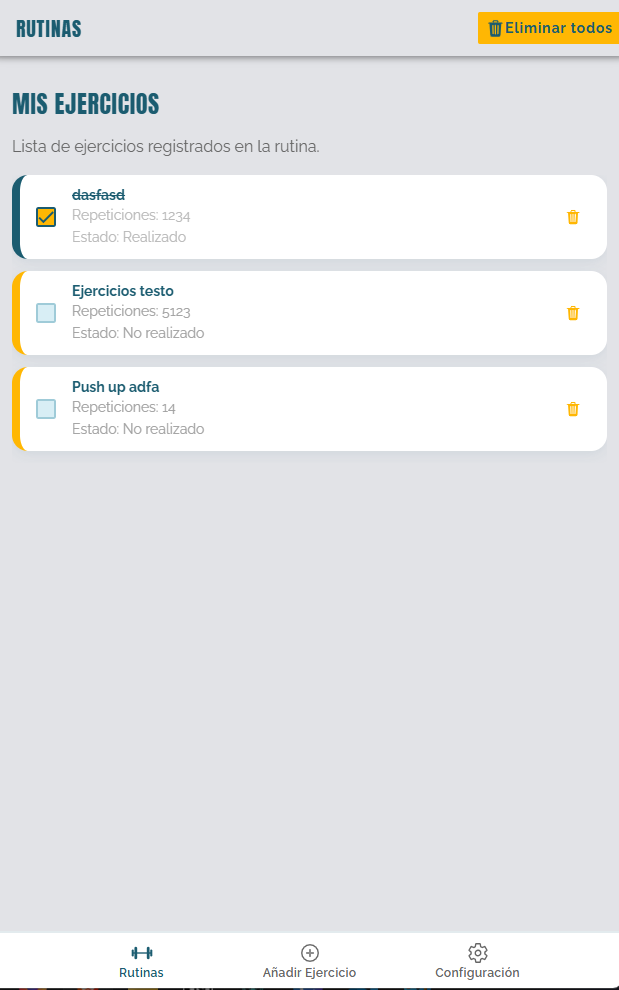
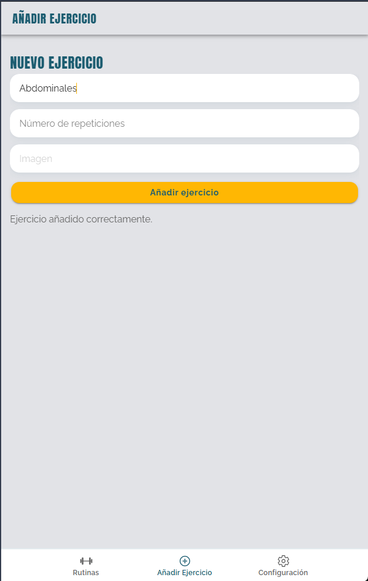
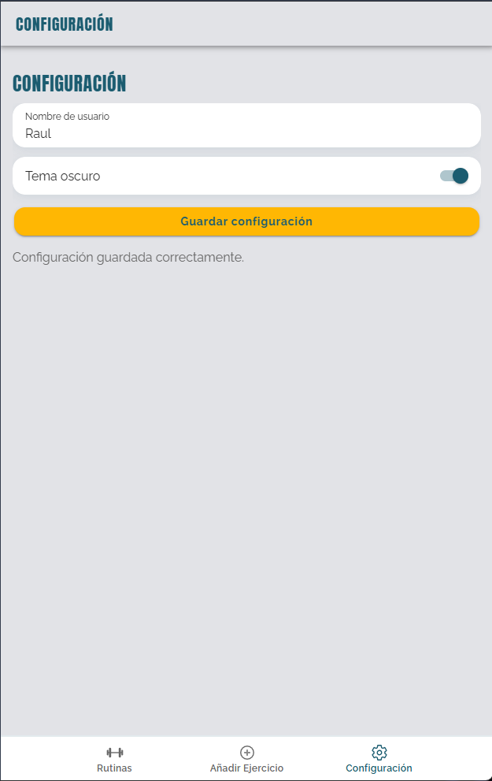

# 💪 Mi Rutina Fitness


---

## 📋 Descripción

**Mi Rutina Fitness** es una aplicación híbrida desarrollada con **Ionic y Angular** orientada a la gestión básica de rutinas de ejercicios.

El proyecto se ha realizado en el contexto académico del módulo de **Programación Multimedia y Dispositivos Móviles**, como práctica de introducción al desarrollo de aplicaciones híbridas. La aplicación permite trabajar conceptos fundamentales como la navegación mediante pestañas, el uso de componentes Ionic, la gestión de formularios, la lógica en TypeScript y la persistencia local de datos mediante Capacitor.

La finalidad principal de la aplicación es permitir que el usuario pueda registrar ejercicios, consultar su rutina, marcar ejercicios como completados y guardar algunas preferencias básicas de configuración.

---

## 🎯 Objetivos del proyecto

- Comprender la estructura básica de un proyecto Ionic con Angular.
- Configurar una aplicación mediante navegación por pestañas.
- Utilizar componentes visuales de Ionic para construir interfaces móviles.
- Gestionar datos desde TypeScript.
- Implementar persistencia local mediante `@capacitor/preferences`.
- Aplicar estilos personalizados mediante SCSS.
- Practicar el uso de Git como sistema de control de versiones.

---

## 🛠️ Tecnologías utilizadas

- **Ionic**
- **Angular**
- **TypeScript**
- **Capacitor**
- **Capacitor Preferences**
- **HTML**
- **SCSS**
- **Git**

---

## ✨ Funcionalidades principales

### 🏋️ Pestaña Rutinas

Permite visualizar la lista de ejercicios registrados por el usuario.

Acciones disponibles:

- ✅ Marcar o desmarcar un ejercicio como realizado.
- 🗑️ Eliminar un ejercicio individual.
- ❌ Eliminar todos los ejercicios registrados.

#### 📸 Captura de pantalla



---

### ➕ Pestaña Añadir Ejercicio

Incluye un formulario para añadir nuevos ejercicios a la rutina: nombre, repeticiones y una imagen opcional (en desarrollo).

Una vez añadido un ejercicio, este se almacena y se muestra en la pestaña de rutinas.

#### 📸 Captura de pantalla



---

### ⚙️ Pestaña Configuración

Permite gestionar preferencias básicas de usuario:

- 👤 Guardar el nombre del usuario.
- 🌙 Activar o desactivar el tema oscuro.

Estos datos se almacenan de forma persistente.

#### 📸 Captura de pantalla



---

## 💾 Persistencia de datos

La aplicación utiliza el plugin:

```bash
@capacitor/preferences